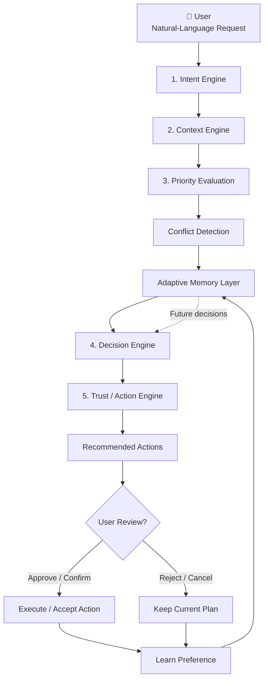
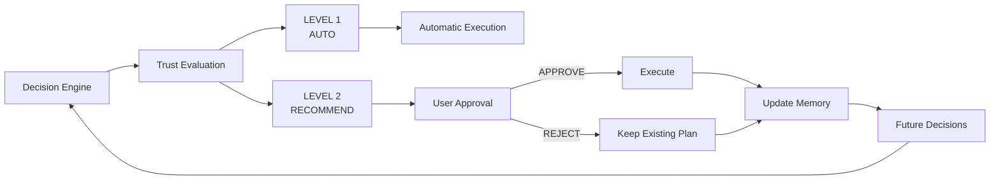
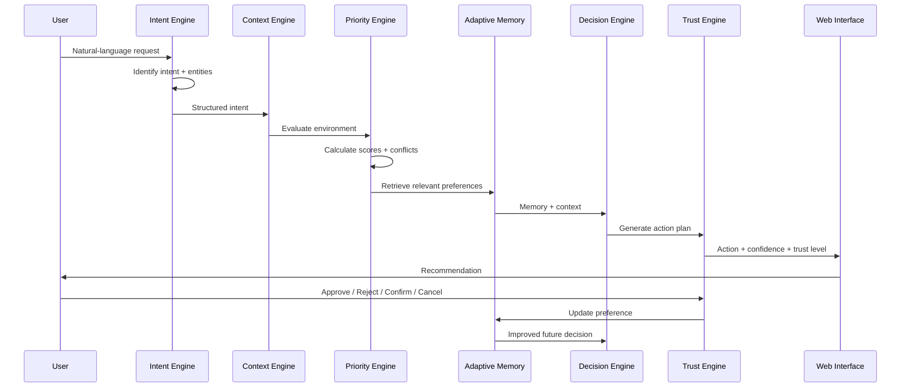
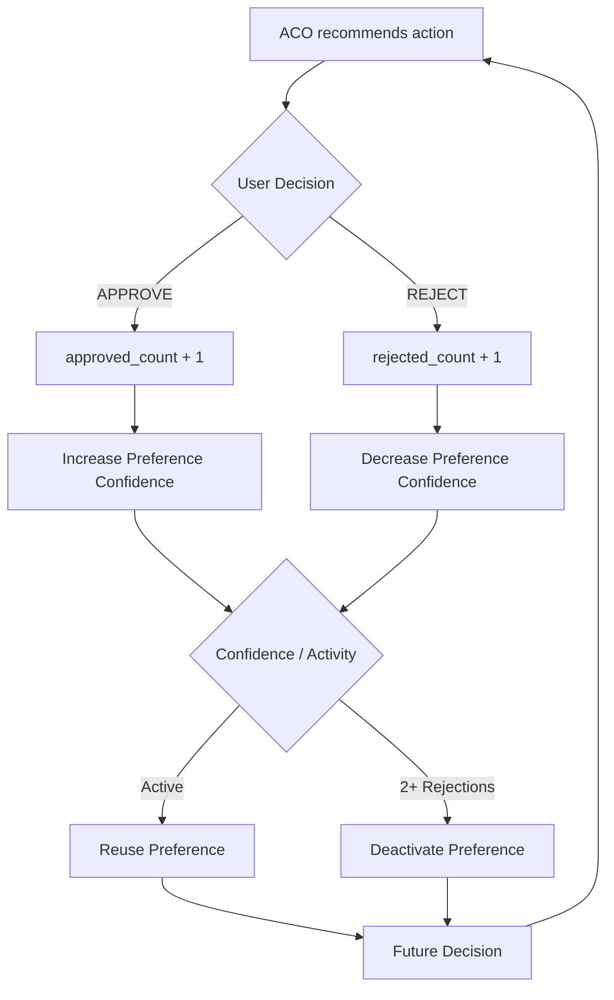

---

# ACO — Adaptive Context Orchestrator

> **A context-aware personal coordination assistant that understands intent, evaluates priorities and conflicts, learns user preferences, and recommends trustworthy actions.**

**Domain:** Agentic AI

---

# 1. Team Details

| Parameter           | Details                                                |
| ------------------- | ------------------------------------------------------ |
| **Team Name**       | ACO                                                    |
| **Project Name**    | Adaptive Context Orchestrator                          |
| **Team Leader**     | `Ranjana Devi K`                                       |
| **Register Number** | `2303121031`                                           |
| **College**         | Women’s Engineering College, Lawspet, Puducherry       |
| **Domain**          | Agentic AI                                             |
| **Project Type**    | AI-powered adaptive coordination system                |
| **Deployment**      | Web-based prototype                                    |

### Project Identity

ACO is not designed as a conventional question-answer chatbot. It is designed as a **decision-support and coordination layer** that interprets a user's situation, identifies competing priorities, applies learned preferences, and produces an actionable plan.

The interface itself identifies the system as **“Adaptive Context Orchestrator — Personal Coordination Assistant.”** 

---

# 2. Problem Statement

## The Problem

Modern digital assistants generally respond to **what the user asks**, but do not sufficiently reason about **what matters most in the user's situation**.

A user may have:

* an examination requiring focused preparation,
* a project meeting at the same time,
* an assignment approaching its deadline,
* travel requirements,
* or several competing commitments.

A conventional assistant may list these items, but the real challenge is **deciding which activity should take priority and what action should be taken**.

ACO addresses this as a **contextual decision problem**.

### Example

```text
User Situation
      │
      ├── Exam Preparation → CRITICAL (22)
      │
      ├── Project Meeting  → MEDIUM (11)
      │
      └── Available Focus Time
                 │
                 ▼
          Detect Conflict
                 │
                 ▼
       Protect Critical Goal
                 │
                 ▼
       Recommend Meeting Shift
```

The current implementation explicitly assigns different priority scores to scenarios such as exams, interviews, assignments and meetings. 

## Target Users

| User Group             | Typical Problem                               | ACO Benefit                                  |
| ---------------------- | --------------------------------------------- | -------------------------------------------- |
| **Students**           | Exams, assignments and meetings overlap       | Priority-aware scheduling                    |
| **Job Seekers**        | Interviews conflict with existing commitments | Protects critical preparation/travel windows |
| **Project Teams**      | Meetings compete with deadlines               | Identifies higher-value activity             |
| **Busy Professionals** | Multiple competing tasks                      | Context-aware action recommendations         |
| **AI Users**           | Generic assistant responses                   | Personalized decision behaviour              |

## Why This Matters

The important shift is:

> **From “answering the request” → to “understanding the situation and coordinating the next action.”**

---

# 3. Proposed Solution

## ACO — Adaptive Context Orchestrator

ACO introduces an **adaptive orchestration pipeline** between the user's natural-language request and the final action recommendation.

Instead of immediately producing an answer, the system performs several reasoning stages.

### Core Architecture



This structure corresponds directly to the implemented processing flow: intent parsing, context/priority evaluation, stateful memory loading, decision planning, trust levels, and action feedback. 

---

## What Makes ACO Different?

| Conventional Assistant         | ACO                                |
| ------------------------------ | ---------------------------------- |
| Responds to request            | Interprets situation               |
| One-shot interaction           | Stateful interaction               |
| Generic recommendations        | Preference-aware decisions         |
| Limited conflict reasoning     | Explicit conflict detection        |
| No decision history            | Adaptive decision memory           |
| Fixed confidence               | Dynamic confidence                 |
| Immediate action               | Trust-controlled action            |
| User feedback ends interaction | Feedback modifies future behaviour |

---

# 4. Approach / Methodology

ACO follows a **five-stage orchestration model with an adaptive feedback loop**.

## Stage 1 — Intent Engine

The system first determines the primary intent of the request.

Current intent categories include:

| Intent                    | Trigger Examples                           |
| ------------------------- | ------------------------------------------ |
| **Event Preparation**     | interview, exam, prepare, test             |
| **Conflict Resolution**   | meeting, move, reschedule, conflict, clash |
| **Priority Optimization** | assignment, due, priority, task            |
| **General Coordination**  | Other requests                             |

The engine also extracts relevant entities such as **Interview, Exam, Project Sync and Systems Assignment**. 

---

## Stage 2 — Context & Priority Engine

The interpreted intent is evaluated against the available environment.

The system calculates contextual priority scores.

### Implemented Example

| Scenario             | Item             |  Score | Level    |
| -------------------- | ---------------- | -----: | -------- |
| Exam                 | Exam Preparation | **22** | CRITICAL |
| Exam                 | Project Sync     | **11** | MEDIUM   |
| Interview            | Interview        | **22** | CRITICAL |
| Interview            | Assignment       | **16** | HIGH     |
| Interview            | Project Sync     | **11** | MEDIUM   |
| Assignment + Meeting | Assignment       | **20** | CRITICAL |
| Assignment + Meeting | Project Sync     | **13** | HIGH     |

These values are implemented in the current `ContextAndPriorityEngine`. 

---

## Stage 3 — Conflict Detection

ACO does not treat events independently.

It identifies **temporal and priority conflicts**.

For example:

```text
             2:00 PM Meeting
                  │
                  │ conflicts with
                  ▼
        3-hour exam focus block
                  │
                  ▼
          EXAM = CRITICAL
          MEETING = MEDIUM
                  │
                  ▼
       Meeting becomes movable
```

The prototype currently demonstrates conflicts such as a project meeting overlapping an exam preparation focus window and a meeting restricting time before an assignment deadline. 

---

# 5. Adaptive Memory Model

This is one of the most important components of ACO.

ACO learns from **user approval and rejection of recommended actions**.

### Memory Structure

```text
                    USER DECISION
                         │
             ┌───────────┴───────────┐
             ▼                       ▼
         APPROVE                  REJECT
             │                       │
             ▼                       ▼
       approved_count++         rejected_count++
             │                       │
             ▼                       ▼
     Confidence increases      Confidence decreases
             │                       │
             └───────────┬───────────┘
                         ▼
                  Active Preference
                         │
                         ▼
              Future Decision Making
```

The implementation stores:

* preference description
* approval count
* rejection count
* confidence
* active/inactive state
* decision history


### Confidence Adaptation

The current implementation starts learned preferences at **60% confidence**.

| User Behaviour    | Confidence Behaviour        |
| ----------------- | --------------------------- |
| First approval    | 60%                         |
| Second approval   | 75%                         |
| Further approvals | +5% up to 95%               |
| Rejection         | −15%                        |
| 2+ rejections     | Preference becomes inactive |


This makes ACO **adaptive rather than static**.

---

# 6. Decision & Trust Architecture

ACO does not treat every recommendation as equally safe to execute.

It uses **trust levels** to control the degree of autonomy.



The backend explicitly generates actions with trust levels and exposes **APPROVE, REJECT, CONFIRM and CANCEL** decisions through the action-decision API. 

### Trust Model

| Level                   | Meaning                                 | Example                          |
| ----------------------- | --------------------------------------- | -------------------------------- |
| **LEVEL 1 — AUTO**      | Low-risk coordination action            | Create clarification/review task |
| **LEVEL 2 — RECOMMEND** | Important change requiring user control | Reschedule project meeting       |
| **User Approval**       | Human remains final authority           | Approve / reject proposed change |

---

# 7. End-to-End Methodology



---

# 8. Technology / Tools

| Technology       | Role in ACO              | Why Used                                 |
| ---------------- | ------------------------ | ---------------------------------------- |
| **Python**       | Core orchestration logic | Fast development and readable AI logic   |
| **FastAPI**      | Backend API              | Lightweight asynchronous API framework   |
| **Pydantic**     | Request validation       | Structured API input models              |
| **HTML5**        | Interface structure      | Simple web deployment                    |
| **JavaScript**   | Client-side interaction  | Dynamic scenarios and action handling    |
| **Tailwind CSS** | UI styling               | Responsive, component-oriented interface |
| **Inter Font**   | UI typography            | Clear readable interface                 |
| **JSON**         | Mock environment         | Lightweight contextual data              |
| **Uvicorn**      | Application server       | ASGI execution                           |
| **Git / GitHub** | Version control          | Collaboration and source management      |
| **Vercel**       | Prototype deployment     | Accessible web-based demonstration       |

The frontend specifically uses **Inter**, Tailwind CSS and a teal-based brand system, while the backend is implemented with FastAPI and Pydantic models.  

---

# 9. System Architecture

```text
┌───────────────────────────────────────────────────────────────┐
│                         ACO USER INTERFACE                    │
│                                                               │
│  Natural Language Input     Quick Scenarios     Review Mode   │
│                                                               │
│  ┌─────────────────────────────────────────────────────────┐  │
│  │                 Personal Coordination                  │  │
│  │                      Assistant                         │  │
│  └─────────────────────────────────────────────────────────┘  │
└─────────────────────────────┬─────────────────────────────────┘
                              │
                              ▼
┌───────────────────────────────────────────────────────────────┐
│                         FASTAPI BACKEND                       │
├───────────────────────────────────────────────────────────────┤
│                                                               │
│  ┌────────────────┐     ┌──────────────────────────────┐     │
│  │ Intent Engine  │────►│ Context & Priority Engine    │     │
│  └────────────────┘     └───────────────┬──────────────┘     │
│                                         │                     │
│                                         ▼                     │
│                           ┌──────────────────────────┐        │
│                           │ Conflict Detection       │        │
│                           └────────────┬─────────────┘        │
│                                        │                      │
│                                        ▼                      │
│                           ┌──────────────────────────┐        │
│                           │ Adaptive Memory Layer    │        │
│                           └────────────┬─────────────┘        │
│                                        │                      │
│                                        ▼                      │
│                           ┌──────────────────────────┐        │
│                           │ Decision Engine           │        │
│                           └────────────┬─────────────┘        │
│                                        │                      │
│                                        ▼                      │
│                           ┌──────────────────────────┐        │
│                           │ Trust / Action Engine     │        │
│                           └────────────┬─────────────┘        │
│                                        │                      │
└────────────────────────────────────────┼──────────────────────┘
                                         │
                                         ▼
                           ┌──────────────────────────┐
                           │ Recommended Action      │
                           │ + Priority              │
                           │ + Confidence            │
                           │ + Trust Level           │
                           └────────────┬─────────────┘
                                        │
                              ┌─────────┴─────────┐
                              ▼                   ▼
                           APPROVE              REJECT
                              │                   │
                              └─────────┬─────────┘
                                        ▼
                               Adaptive Memory Update
```

---

# 10. Expected Output / MVP

The MVP is a **working browser-based personal coordination assistant**.

## Current MVP Capabilities

| Feature                        | Implementation Status |
| ------------------------------ | --------------------- |
| Natural-language request input | ✅                     |
| Intent classification          | ✅                     |
| Entity extraction              | ✅                     |
| Context evaluation             | ✅                     |
| Priority scoring               | ✅                     |
| Conflict detection             | ✅                     |
| Action generation              | ✅                     |
| Trust-level assignment         | ✅                     |
| Review-before-acting mode      | ✅                     |
| Approve / Reject decisions     | ✅                     |
| Adaptive preference learning   | ✅                     |
| Confidence tracking            | ✅                     |
| Learned preference display     | ✅                     |
| Technical reasoning trace      | ✅                     |
| Memory clearing                | ✅                     |
| Scenario-based demonstration   | ✅                     |

The interface includes **Review before acting**, a chronological **Your Plan** section, **What I've learned**, and an expandable **technical reasoning** panel. 

---

# 11. Interactive MVP Demonstration

The prototype contains predefined scenarios for demonstrating the orchestration engine.

### Scenario A — Exam Conflict

```text
"I have an important exam tomorrow and a normal
project meeting conflicts with my preparation time."
```

ACO identifies:

**Exam Preparation → 22 / CRITICAL**

**Project Sync → 11 / MEDIUM**

and detects that the meeting overlaps the required preparation window. 

---

### Scenario B — Interview

```text
"I'm going to Bangalore tomorrow for an interview.
Make sure I don't miss anything."
```

ACO evaluates:

```text
Interview       → 22 → CRITICAL
Assignment      → 16 → HIGH
Project Sync    → 11 → MEDIUM
```

The system can identify the travel/interview conflict and generate a recommended action.

---

### Scenario C — Assignment Deadline

```text
"I have a project meeting at 2 PM but my assignment
is due at 5 PM. Help me manage this."
```

ACO evaluates:

```text
Assignment      → 20 → CRITICAL
Project Sync    → 13 → HIGH
```

and generates a recommendation to protect the assignment focus period. 

---

# 12. User Feedback → Learning Loop

The most distinctive MVP behaviour is that **the user can teach the assistant**.



The backend's `learn_preference()` mechanism implements this adaptive behaviour rather than merely displaying static “memory.” 

---

# 13. Explainability & Transparency

ACO is designed to make its reasoning visible.

Instead of only displaying:

> **“Reschedule your meeting.”**

the prototype can expose:

```text
Intent:
Conflict Resolution

Context:
Exam Preparation

Priority:
Exam Preparation → 22 / CRITICAL
Project Sync → 11 / MEDIUM

Conflict:
Meeting overlaps required preparation window

Memory:
Existing preference applied

Decision:
Protect critical event

Trust:
LEVEL 2 — RECOMMEND

Confidence:
90%

Action:
Reschedule Project Sync
```

The frontend provides a dedicated **“View technical reasoning”** section for exposing this trace. 

---

# 14. API Design

The current backend exposes three primary functional operations.

| Method | Endpoint               | Function                                  |
| ------ | ---------------------- | ----------------------------------------- |
| `POST` | `/api/process`         | Processes user request and generates plan |
| `POST` | `/api/action-decision` | Records user approval/rejection           |
| `POST` | `/api/clear-memory`    | Resets learned preferences                |
| `GET`  | `/`                    | Serves the web interface                  |

The `/api/process` endpoint accepts a user message and `review_mode`, while `/api/action-decision` receives the selected action and user decision. 

---

# 15. Feasibility

ACO is highly feasible within a hackathon because the prototype uses a **modular, lightweight architecture**.

### Technical Feasibility

```text
                  ACO MVP
                    │
        ┌───────────┼───────────┐
        ▼           ▼           ▼
     Frontend    Backend      Memory
     HTML/JS     FastAPI      Python
        │           │           │
        └───────────┼───────────┘
                    ▼
             Working Prototype
```

### Why It Is Achievable

| Factor               | Feasibility                                    |
| -------------------- | ---------------------------------------------- |
| Hardware requirement | Minimal                                        |
| Backend complexity   | Lightweight Python architecture                |
| UI development       | HTML + Tailwind + JavaScript                   |
| Data requirement     | Mock contextual environment sufficient for MVP |
| Memory               | In-process stateful store                      |
| Deployment           | Web-based                                      |
| Testing              | Predefined real-world scenarios                |
| Scalability          | Modular components can be replaced/extended    |

The current application already loads a mock environment, processes scenarios through modular engines, and maintains stateful memory in Python. 

---

# 16. Current Prototype Metrics

The current implementation provides measurable internal decision signals that can be demonstrated during evaluation:

| Metric                              |                  Current Prototype |
| ----------------------------------- | ---------------------------------: |
| Core reasoning stages               |                              **5** |
| Demonstration scenarios             |                              **3** |
| Intent categories                   |                              **4** |
| Example priority levels             | **LOW / MEDIUM / HIGH / CRITICAL** |
| Highest demonstrated priority score |                             **22** |
| Initial memory confidence           |                            **60%** |
| Second approval confidence          |                            **75%** |
| Maximum preference confidence       |                            **95%** |
| Rejection confidence reduction      |           **15 percentage points** |
| Rejections to deactivate preference |                              **2** |
| Trust levels demonstrated           |                              **2** |
| User decision types                 |                              **4** |
| Core API operations                 |                              **4** |

These are **implementation metrics**, not claims about real-world accuracy or user performance. The scoring and confidence behaviour come directly from the uploaded backend.  

---

# 17. Team Roles

| Team Member | Role | Primary Responsibility | Deliverable |
| ------------ | ---- | ---------------------- | ----------- |
| **Ranjana Devi K** | Team Lead / AI & System Architect | Agentic AI architecture, system integration, intent analysis, priority logic, decision-making, and overall project coordination | Complete ACO Agentic AI system |
| **Bhavani Prabu** | Backend / UI & Testing Developer | FastAPI backend, adaptive memory, API integration, frontend interface, testing, debugging, and documentation | Functional backend, web interface, and validated MVP |

---

# 18. References / Data Sources

## Technical References

1. **FastAPI Documentation** — backend API architecture.
2. **Pydantic Documentation** — structured request validation.
3. **Tailwind CSS Documentation** — responsive interface development.
4. **Vercel Documentation** — web deployment.
5. **Python Documentation** — application and state-management implementation.
6. Research literature related to:

   * Adaptive User Interfaces
   * Human-Centered AI
   * Context-Aware Computing
   * Intelligent Decision Support Systems
   * Human-in-the-Loop AI
   * Personalized AI Assistants

## Project Data Sources

The current MVP does **not depend on a large external training dataset**.

It uses:

```text
User Natural-Language Input
          +
Mock Environment Data
          +
Detected Intent
          +
Priority / Conflict Rules
          +
Learned User Preferences
          ↓
     ACO Decision
```

The backend explicitly loads contextual information from a `mock_data.json` environment and combines it with the user's request and adaptive memory. 

---

# 19. Project Structure

```text
ACO/
│
├── main.py
│   ├── MemoryStore
│   ├── IntentEngine
│   ├── ContextAndPriorityEngine
│   ├── DecisionEngine
│   └── FastAPI Routes
│
├── templates/
│   └── index.html
│       ├── User Input
│       ├── Scenario Controls
│       ├── Action Cards
│       ├── Timeline
│       ├── Learned Memory
│       └── Technical Reasoning
│
├── mock_data.json
│   └── Contextual Environment
│
├── requirements.txt
│
└── README.md
```

---

# 20. Future Scope

ACO can evolve from a hackathon prototype into a more comprehensive **personal decision orchestration platform**.

### Phase 1 — Current MVP

```text
Natural Language
       ↓
Intent
       ↓
Context
       ↓
Priority
       ↓
Conflict
       ↓
Memory
       ↓
Decision
       ↓
Action
```

### Phase 2 — Enhanced Intelligence

```text
Calendar ───────┐
Tasks ──────────┤
Email ──────────┤
Location ───────┤
User Behaviour ─┤
                 ▼
          Context Fusion
                 │
                 ▼
       Adaptive Decision Model
```

### Potential Extensions

* Real calendar integration
* Real task-management integration
* Long-term user profiles
* More sophisticated ML-based priority prediction
* Natural-language preference learning
* Voice interaction
* Multimodal context
* Personalized scheduling
* Reinforcement-learning-based adaptation
* Multi-user/team coordination
* Privacy-preserving local memory

---

# 21. Final Project Vision

```text
                ┌───────────────────────┐
                │      USER CONTEXT     │
                │                       │
                │ Goals • Tasks • Time  │
                │ Preferences • History │
                └───────────┬───────────┘
                            │
                            ▼
                ┌───────────────────────┐
                │          ACO          │
                │                       │
                │ Understand            │
                │ Prioritize            │
                │ Resolve               │
                │ Remember              │
                │ Recommend             │
                └───────────┬───────────┘
                            │
                            ▼
                ┌───────────────────────┐
                │   TRUSTWORTHY ACTION  │
                │                       │
                │ Human approval where  │
                │ intervention matters  │
                └───────────┬───────────┘
                            │
                            ▼
                ┌───────────────────────┐
                │       FEEDBACK        │
                │                       │
                │   Approve / Reject    │
                │        ↓              │
                │    Learn & Adapt      │
                └───────────┬───────────┘
                            │
                            └──────────► ACO
```

## **Core Idea**

> **ACO does not simply tell the user what can be done. It reasons about what should matter most, recommends an action with an appropriate trust level, and learns from the user's decisions.**

---

### Live MVP

[ACO — Adaptive Context Orchestrator Prototype](https://aco-prototype.vercel.app/)

